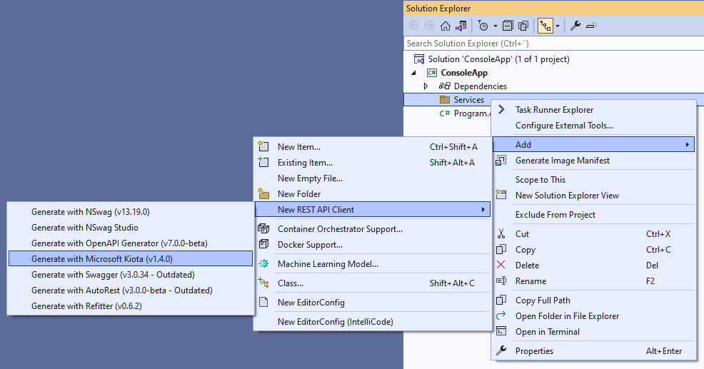
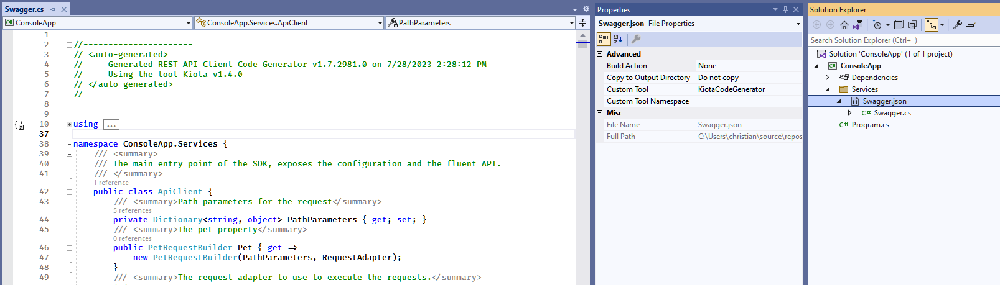
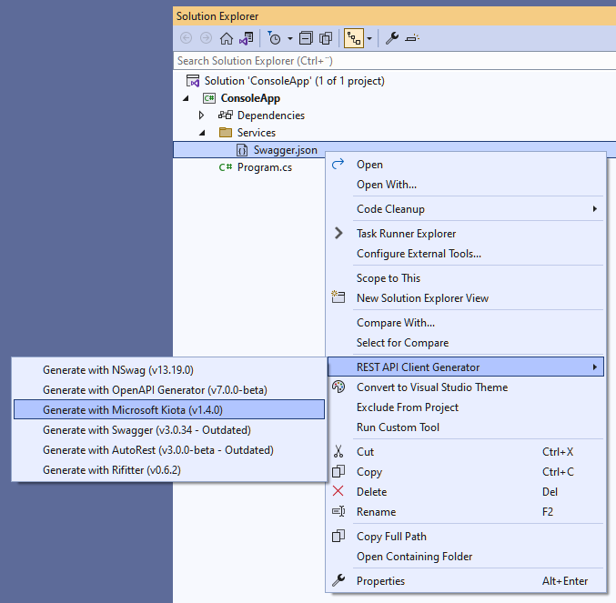

# Install Kiota

Kiota can be accessed in the following ways.

- [Download binaries](#download-binaries)
- [Run in Docker](#run-in-docker)
- [Install as .NET tool](#install-as-net-tool)
- [Build from source](#build-from-source)
- [Install the Visual Studio Code extension (preview)](#install-the-visual-studio-code-extension)

Community provided options:
- [Install with asdf](#install-with-asdf)
- [REST API Client Code Generator extension for Visual Studio](#rest-api-client-code-generator)

## Download binaries

You can download the latest version for your operating system.

| Operating system | Download                                                                                   |
|------------------|--------------------------------------------------------------------------------------------|
| Linux (x64)      | [linux-x64.zip](https://aka.ms/get/kiota/latest/linux-x64.zip) |
| macOS (arm64)    | [osx-arm64.zip](https://aka.ms/get/kiota/latest/osx-arm64.zip) |
| macOS (x64)      | [osx-x64.zip](https://aka.ms/get/kiota/latest/osx-x64.zip)     |
| Windows (x64)    | [win-x64.zip](https://aka.ms/get/kiota/latest/win-x64.zip)     |
| Windows (x86)    | [win-x86.zip](https://aka.ms/get/kiota/latest/win-x86.zip)     |

[All releases](https://github.com/microsoft/kiota/releases/latest)

## Run in Docker

You can run Kiota in our Docker container with one of the following commands.

```bash
docker run -v /some/output/path:/app/output \
-v /some/input/description.yml:/app/openapi.yml \
mcr.microsoft.com/openapi/kiota generate --language csharp -n namespace-prefix
```

> [!TIP]
> You can alternatively use the `--openapi` parameter with a URI instead of volume mapping.

To generate a SDK from an online OpenAPI description and into the current directory:

```bash
docker run -v ${PWD}:/app/output mcr.microsoft.com/openapi/kiota \
generate --language typescript -n gfx -d \
https://raw.githubusercontent.com/microsoftgraph/msgraph-sdk-powershell/dev/openApiDocs/v1.0/Mail.yml
```

## Install as .NET tool

If you have the [.NET SDK](https://dotnet.microsoft.com/download) installed, you can install Kiota as a [.NET tool](/dotnet/core/tools/global-tools).

Execute the following command to install the tool.

```bash
dotnet tool install --global Microsoft.OpenApi.Kiota
```

## Build from source

1. Clone the current repository.
1. Install the [.NET SDK 7.0](https://get.dot.net/7).
1. Open the solution with Visual Studio and right click *publish* **--or--** execute the following command:

    ```bash
    dotnet publish ./src/kiota/kiota.csproj -c Release -p:PublishSingleFile=true -r win-x64
    ```

1. Navigate to the output directory (usually under `src/kiota/bin/Release/net7.0`).
1. Run `kiota.exe ...`.

> [!NOTE]
> Refer to [.NET runtime identifier catalog](/dotnet/core/rid-catalog) so select the appropriate runtime for your platform.

## Install the Visual Studio Code extension

1. Open the [Marketplace page of the extension](https://aka.ms/kiota/extension)
1. Click on the **Install** button.

## Install with asdf
> [!IMPORTANT]
> The asdf Kiota plugin is maintained and distributed by the community and is not an official Microsoft plugin. Microsoft makes no warranties, express or implied, with respect to the plugin or its use. Use of this plugin is at your own risk. Microsoft shall not be liable for any damages arising out of or in connection with the use of this plugin.

The community has made Kiota available as an [asdf plugin](https://asdf-vm.com/manage/plugins.html). To install the `asdf-kiota` plugin follow these instructions:

```bash
asdf plugin add kiota
# or
asdf plugin add kiota https://github.com/asdf-community/asdf-kiota.git

# Show all installable versions
asdf list-all kiota

# Install specific version
asdf install kiota latest

# Set a version globally (on your ~/.tool-versions file)
asdf global kiota latest

# Now kiota commands are available
kiota --version
```

## REST API Client Code Generator

> [!IMPORTANT]
> The REST API Client Code Generator extension for Visual Studio is maintained and distributed by the community and is not an official Microsoft Visual Studio extension. Microsoft makes no warranties, express or implied, with respect to the extension or its use. Use of this extension is at your own risk. Microsoft shall not be liable for any damages arising out of or in connection with the use of this extension.

[REST API Client Code Generator](https://github.com/christianhelle/apiclientcodegen) is a collection of Visual Studio C# custom tool code generators for OpenAPI specifications. This extension will install Kiota on-demand and will also add the required NuGet packages to build the generated code to the project. The generated code is created as a "code-behind" file to the OpenAPI specifications file in the .NET project. This extension offers same-day releases for new Kiota versions, but this requires updating the extension, which can be configured to be automatically.

**Installation:**

1. From Visual Studio (Windows), using the [Manage Extensions](https://learn.microsoft.com/visualstudio/ide/finding-and-using-visual-studio-extensions) dialog box (Tools -> Manage Extensions), search for extension  called [REST API Client Code Generator](https://marketplace.visualstudio.com/items?itemName=ChristianResmaHelle.ApiClientCodeGenerator2022). This extension is available for [Visual Studio 2022 for AMD64 and ARM64](https://marketplace.visualstudio.com/items?itemName=ChristianResmaHelle.ApiClientCodeGenerator2022) and [Visual Studio 2019](https://marketplace.visualstudio.com/items?itemName=ChristianResmaHelle.ApiClientCodeGenerator)

   For Visual Studio for Mac, follow [these instructions](https://github.com/christianhelle/apiclientcodegen/blob/master/docs/VisualStudioForMac.md#installation)

2. Click on the **Download** button. The extension will be installed after closing Visual Studio so you will need to do a restart

**Usage:**

To generate code using Kiota, Right click on a project or location under a project and select **Add -> New REST API Client -> Generate with Microsoft Kiota**



This will prompt you for a URL to download the OpenAPI specifications file.

If the operation worked successfully then you should see a code-behind file for the OpenAPI specifications. Once you have generated code, all changes to the OpenAPI specifications file will trigger a re-generation of the code-behind file via the **KiotaCodeGenerator** custom tool



If you already have a OpenAPI specifications file in the project, then you can also generate code using Kiota by right clicking on the file then selecting **REST API Client Generator -> Generate with Microsoft Kiota**



## Next steps

For details on running Kiota, see [Using the Kiota tool](using.md).