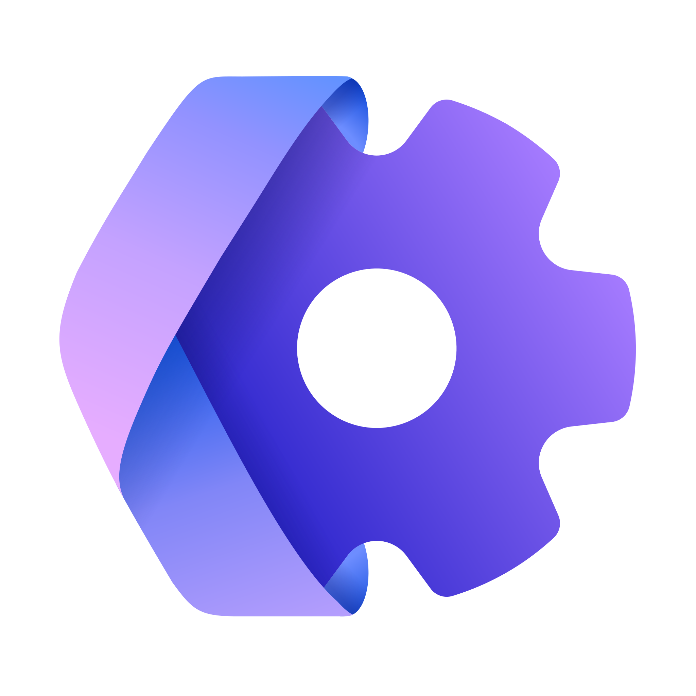

# Welcome to Kiota

Kiota is a command line tool for generating an API client to call any OpenAPI-described API you're interested in. The goal is to eliminate the need to take a dependency on a different API client library for every API that you need to call. Kiota API clients provide a strongly typed experience with all the features you expect from a high quality API SDK, but without having to learn a new library for every HTTP API.

- [Get started with Kiota](install.md)

## Features

- Provides support for a wide range of languages: C#, CLI, Go, Java, PHP, Python, Ruby, and TypeScript
- Uses the full capabilities of OpenAPI descriptions
- Enables low effort implementation of new language support
- Generates only the source code necessary by building on a core library
- Minimizes external dependencies
- Uses JSON Schema descriptions to generate primitive based model serialization/deserialization code
- Enables generation of code for only a specified subset of an OpenAPI description
- Generates code that enables IDE autocomplete to aid in API resource discovery
- Enables full access to HTTP capabilities

## Next steps

- To discover more about the developer experience that Kiota API clients provide, see [Kiota API client experience](experience.md).
- For details about how to use Kiota to generate API clients, see [Using the Kiota tool](using.md).
- To gain a better understanding of how Kiota works and how to extend it for other languages, see [Kiota design overview](design.md).
